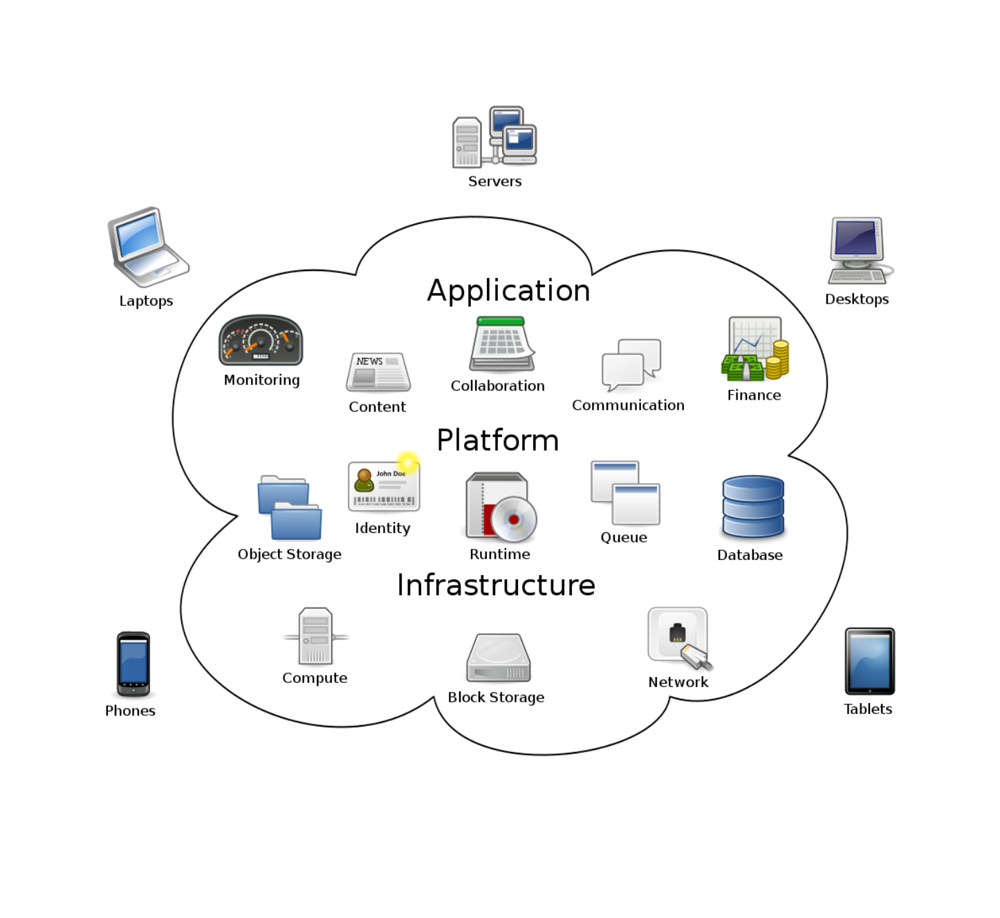
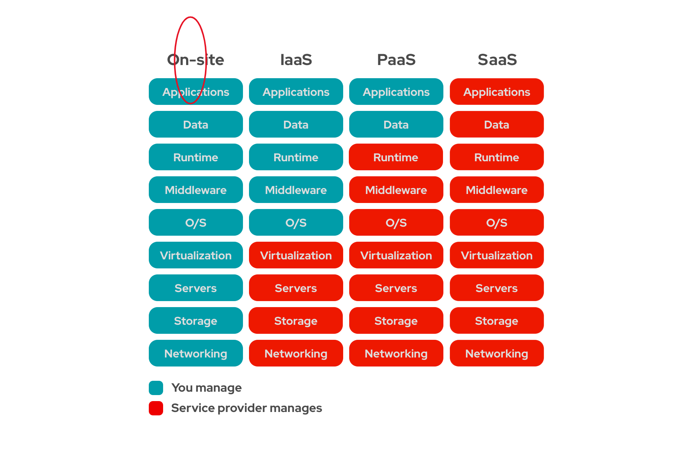
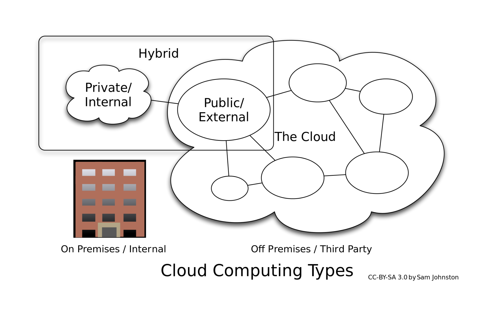

# Cloud Computing
- On demands delivery of computing services/resources
- Instead of owning and maintaining the hardware and staff you can rent cloud services

  
## Cloud Services

### IaaS
Infrastructure as a service

	* Self-service for accessing and monitoring computers, networking, storage, and other
	* Amazon Web Services(AWS), Microsoft Azure, Google Compute Engine (GCE)
### PaaS
Platform as a service	

    * Software over the internet framework for developers
	* Windows Azure, Google App engine, Apache Stratos
### SaaS 
Software as a Service

	* Applications over the internet
	* Google Workspace, Dropbox, Cisco WebEx

## Deployment types [Public and private cloud]

### Public
Public clouds are the most common type of cloud computing deployment. The cloud resources (like servers and storage) are owned and operated by a third-party cloud service provider and delivered over the Internet. With a public cloud, all hardware, software and other supporting infrastructure are owned and managed by the cloud service provider. Microsoft Azure is an example of a public cloud
   
    * Lower cost
    * No maintenance
    * Near-unlimited scalability
    * High reliability 

### Private
Private cloud consists of cloud computing resources used exclusively by one business or organisation. The private cloud can be physically located at your organisation’s on-site data centre, or it can be hosted by a third-party service provider. But in a private cloud, the services and infrastructure are always maintained on a private network and the hardware and software are dedicated solely to your organisation

    * More flexibility
    * More Control
    * More scalability

### Hybrid
A combination of both the private and public benefits of both but also without giving the cloud provider access to the entirety of your data. Only running certain workloads in thej cloud while keeping highly sensitive data in their own data center to meet clients’ needs or regulatory requirements  	

    * Control
    * Flexibility
    * Cost effectiveness
    * Ease