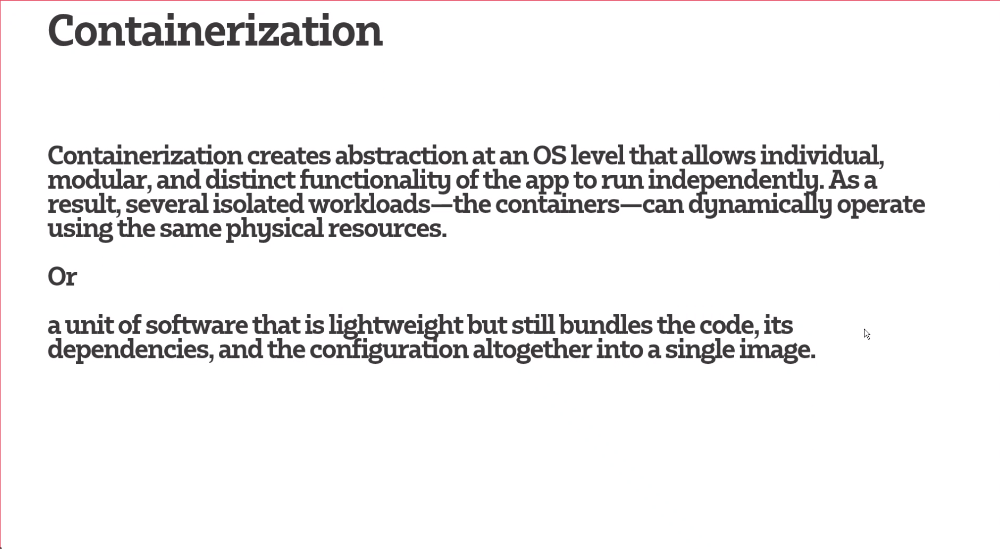
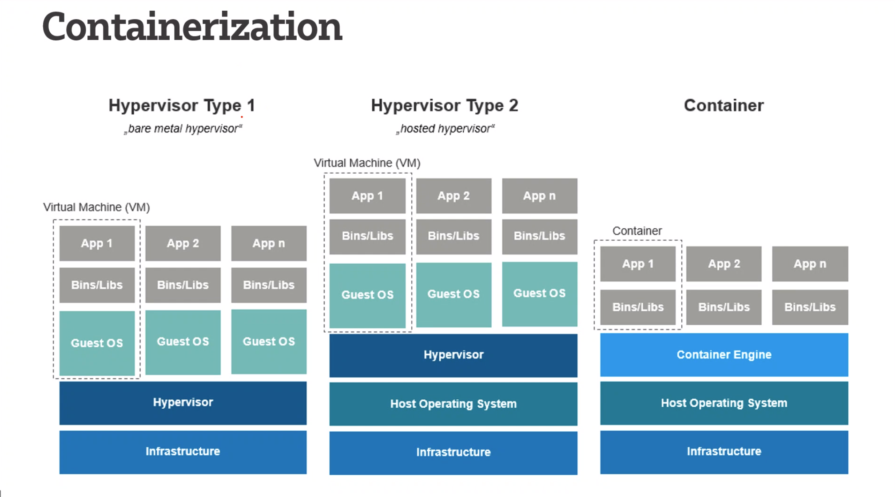

# Containerisation
    
    Almost always used in a cloud environment
    Used to allow applications to run in an efficient and bug-free way across differnt devices/platforms
    (Desktop, Virutal Machine, Windows, Linux)

