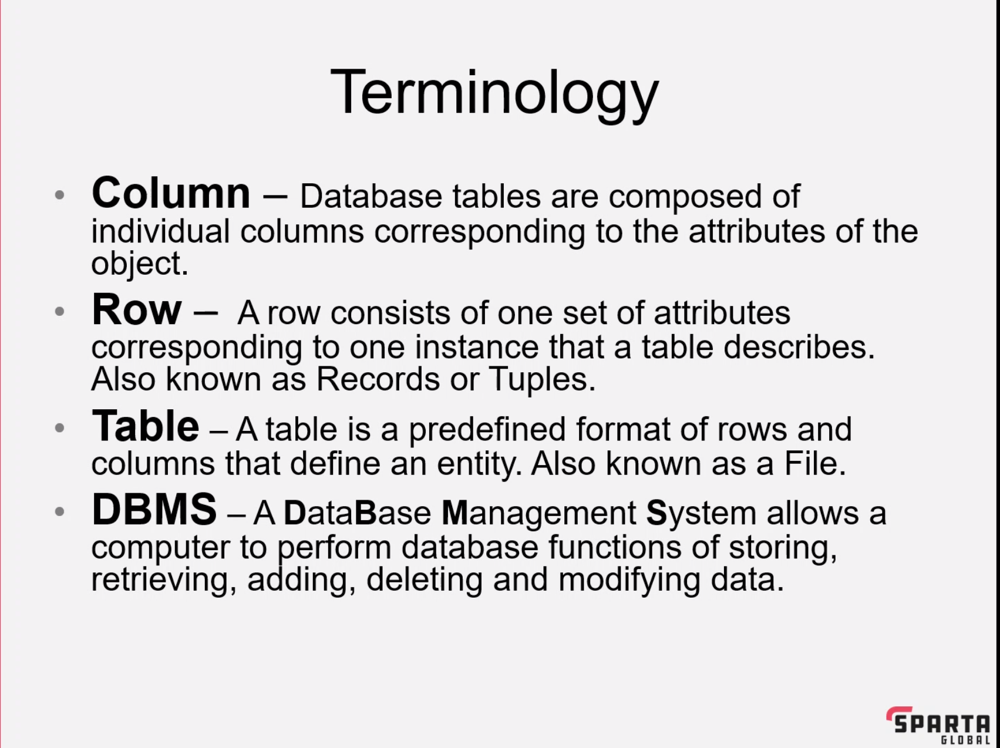
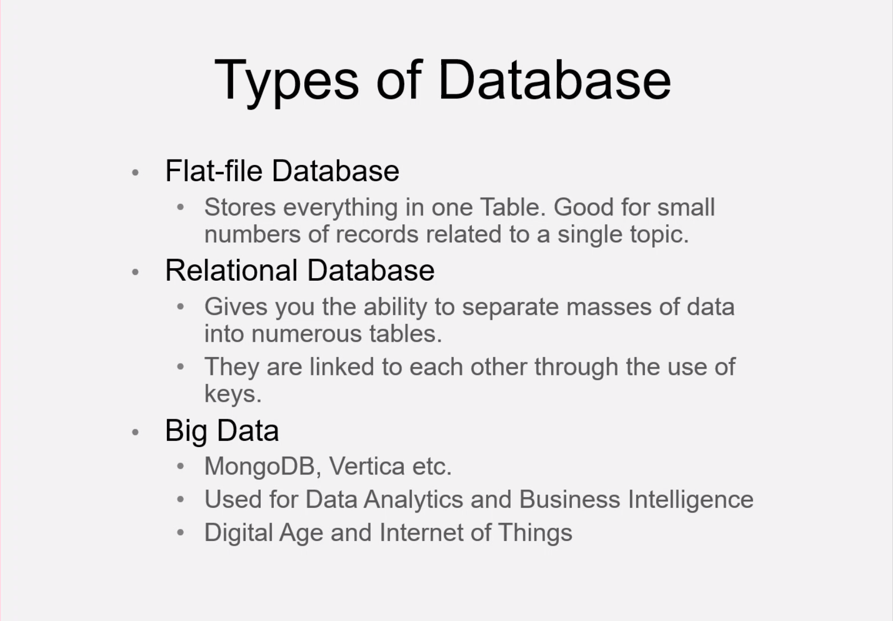
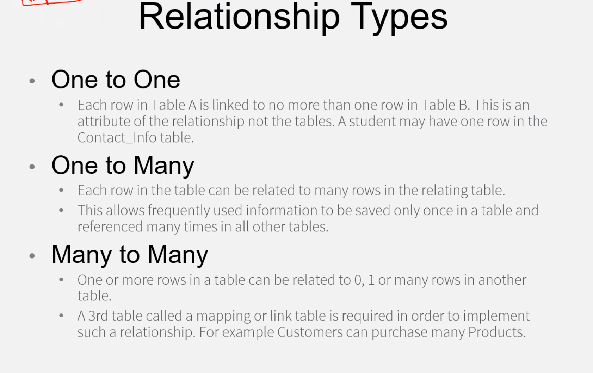
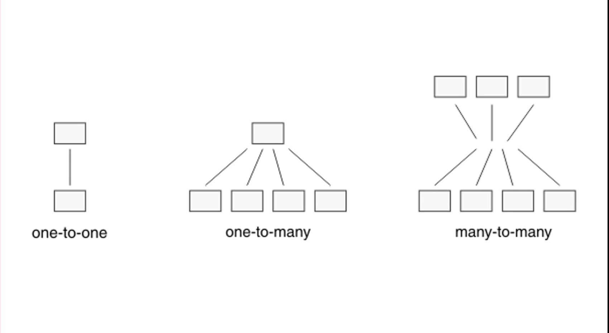
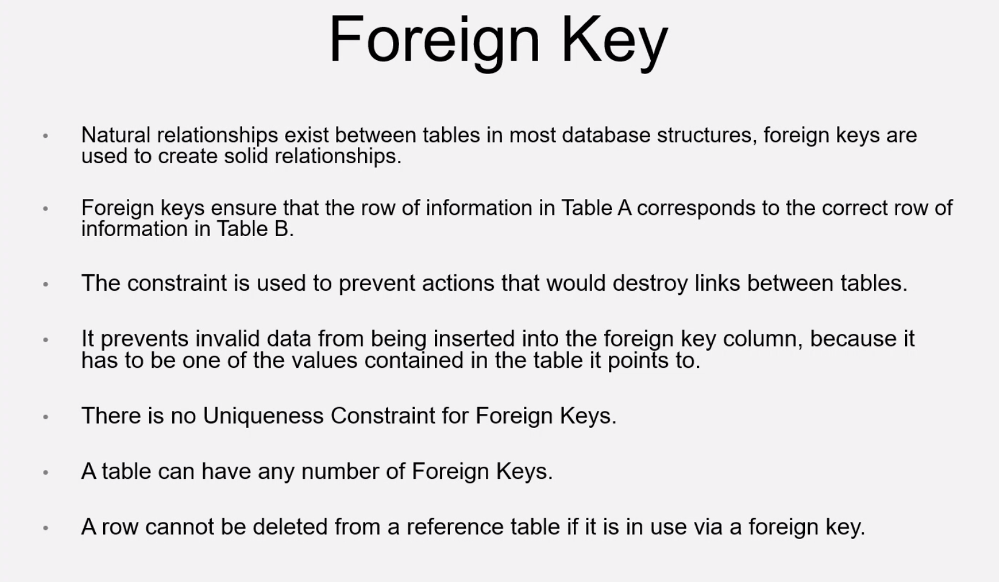

# DataBase

## What is a database
- A structure of data held on a computer
 - That is accessible by other devices

## Types of data base

## Relationship types

# Primary key

    The primary key is a unique identifer for each record in the table
    Each table should have a primary key
    Cannot be changed
    
- Each table can have more than one primary key (composite key) i.e Order NO. & Order Line NO.
- it can be an attribute that is guaranteed to be unique, or it is generated by the DBMS (DataBase Management System)
- The DBMS will enforce the uniqueness of teh primary key stopping any record to be repeated in the table

## Foreign Key

## Database tools
Microsoft access 
    
    Light weight for smaller projects
Microsoft Server 

    Used to be accessed by more poeple at the same 

PostgreSQL

    Uses all the SQL standards

SQLlight 
    
    Better for smaller databases
    very light

MySQL
    
    Can be installed on any OS
    Widly used, and works with SQL

Redis 

    Open source
    advanced key-value store
    Known as the data structure server
    Doesnt offer SQl servers

MongoDB

    Mainly used for big data
    Used JSON-style documentation

Oracle

    Used in HUge project
    Paid for services 

### Data manipulation lan  
- Select
- Insert 
- Update
- Delete
### Data Definition lan
- Create
- Alter
- Drop 
- Truncate
### Data Control Lan
- Grant 
- Revoke
### Transaction control Lan
- Commit
- Rollback
- Savepoint 

## Reference
https://dev.mysql.com/doc/refman/8.0/en/data-types.html
## String Data Types

| Data type                 | Description                                                                                                                                                                                                                                                                                    |
| ------------------------- | ---------------------------------------------------------------------------------------------------------------------------------------------------------------------------------------------------------------------------------------------------------------------------------------------- |
| CHAR(size) | A FIXED length string (can contain letters, numbers, and special characters). The size parameter specifies the column length in characters - can be from 0 to 255. Default is 1 |
| VARCHAR(size) | A VARIABLE length string (can contain letters, numbers, and special characters). The size parameter specifies the maximum column length in characters - can be from 0 to 65535 |
| BINARY(size) | Equal to CHAR(), but stores binary byte strings. The size parameter specifies the column length in bytes. Default is 1 |
| VARBINARY(size) | Equal to VARCHAR(), but stores binary byte strings. The size parameter specifies the maximum column length in bytes. |
| TINYBLOB | For BLOBs (Binary Large OBjects). Max length: 255 bytes |
| TINYTEXT | Holds a string with a maximum length of 255 characters |
| TEXT(size) | Holds a string with a maximum length of 65,535 bytes |
| BLOB(size) | For BLOBs (Binary Large OBjects). Holds up to 65,535 bytes of data |
| MEDIUMTEXT | Holds a string with a maximum length of 16,777,215 characters |
| MEDIUMBLOB | For BLOBs (Binary Large OBjects). Holds up to 16,777,215 bytes of data |
| LONGTEXT | Holds a string with a maximum length of 4,294,967,295 characters |
| LONGBLOB | For BLOBs (Binary Large OBjects). Holds up to 4,294,967,295 bytes of data |
| ENUM(val1, val2, val3, ...) | A string object that can have only one value, chosen from a list of possible values. You can list up to 65535 values in an ENUM list. If a value is inserted that is not in the list, a blank value will be inserted. The values are sorted in the order you enter them |
| SET(val1, val2, val3, ...) | A string object that can have 0 or more values, chosen from a list of possible values. You can list up to 64 values in a SET list |

## Numeric Data Types

| Data type                 | Description                                                                                                                                                                                                                                                                                    |
| ------------------------- | ---------------------------------------------------------------------------------------------------------------------------------------------------------------------------------------------------------------------------------------------------------------------------------------------- |
| BIT(size)                 | A bit-value type. The number of bits per value is specified in size. The size parameter can hold a value from 1 to 64. The default value for size is 1.                                                                                                                                        |
| TINYINT(size)             | A very small integer. Signed range is from -128 to 127. Unsigned range is from 0 to 255. The size parameter specifies the maximum display width (which is 255)                                                                                                                                 |
| BOOL                      | Zero is considered as false, nonzero values are considered as true.                                                                                                                                                                                                                            |
| BOOLEAN                   | Equal to BOOL                                                                                                                                                                                                                                                                                  |
| SMALLINT(size)            | A small integer. Signed range is from -32768 to 32767. Unsigned range is from 0 to 65535. The size parameter specifies the maximum display width (which is 255)                                                                                                                                |
| MEDIUMINT(size)           | A medium integer. Signed range is from -8388608 to 8388607. Unsigned range is from 0 to 16777215. The size parameter specifies the maximum display width (which is 255)                                                                                                                        |
| INT(size)                 | A medium integer. Signed range is from -2147483648 to 2147483647. Unsigned range is from 0 to 4294967295. The size parameter specifies the maximum display width (which is 255)                                                                                                                |
| INTEGER(size)             | Equal to INT(size)                                                                                                                                                                                                                                                                             |
| BIGINT(size)              | A large integer. Signed range is from -9223372036854775808 to 9223372036854775807. Unsigned range is from 0 to 18446744073709551615. The size parameter specifies the maximum display width (which is 255)                                                                                     |
| FLOAT(size, d)            | A floating point number. The total number of digits is specified in size. The number of digits after the decimal point is specified in the d parameter. This syntax is deprecated in MySQL 8.0.17, and it will be removed in future MySQL versions                                             |
| FLOAT(p)                  | A floating point number. MySQL uses the p value to determine whether to use FLOAT or DOUBLE                                                                                                                                                                                                    |
| DOUBLE(size, d)           | A normal-size floating point number. The total number of digits is specified in size. The number of digits after the decimal point is specified in the d parameter                                                                                                                             |
| DOUBLE PRECISION(size, d) |                                                                                                                                                                                                                                                                                                |
| DECIMAL(size, d)          | An exact fixed-point number. The total number of digits is specified in size. The number of digits after the decimal point is specified in the d parameter. The maximum number for size is 65. The maximum number for d is 30. The default value for size is 10. The default value for d is 0. |
| DEC(size, d)              | Equal to DECIMAL(size,d)                                                                                                                                                                                                                                                                       |

## Date & Time 

| Data type                 | Description                                                                                                                                                                                                                                                                                    |
| ------------------------- | ---------------------------------------------------------------------------------------------------------------------------------------------------------------------------------------------------------------------------------------------------------------------------------------------- |
| CHAR(size) | A FIXED length string (can contain letters, numbers, and special characters). The size parameter specifies the column length in characters - can be from 0 to 255. Default is 1 |
| VARCHAR(size) | A VARIABLE length string (can contain letters, numbers, and special characters). The size parameter specifies the maximum column length in characters - can be from 0 to 65535 |
| BINARY(size) | Equal to CHAR(), but stores binary byte strings. The size parameter specifies the column length in bytes. Default is 1 |
| VARBINARY(size) | Equal to VARCHAR(), but stores binary byte strings. The size parameter specifies the maximum column length in bytes. |
| TINYBLOB | For BLOBs (Binary Large OBjects). Max length: 255 bytes |
| TINYTEXT | Holds a string with a maximum length of 255 characters |
| TEXT(size) | Holds a string with a maximum length of 65,535 bytes |
| BLOB(size) | For BLOBs (Binary Large OBjects). Holds up to 65,535 bytes of data |
| MEDIUMTEXT | Holds a string with a maximum length of 16,777,215 characters |
| MEDIUMBLOB | For BLOBs (Binary Large OBjects). Holds up to 16,777,215 bytes of data |
| LONGTEXT | Holds a string with a maximum length of 4,294,967,295 characters |
| LONGBLOB | For BLOBs (Binary Large OBjects). Holds up to 4,294,967,295 bytes of data |
| ENUM(val1, val2, val3, ...) | A string object that can have only one value, chosen from a list of possible values. You can list up to 65535 values in an ENUM list. If a value is inserted that is not in the list, a blank value will be inserted. The values are sorted in the order you enter them |
| SET(val1, val2, val3, ...) | A string object that can have 0 or more values, chosen from a list of possible values. You can list up to 64 values in a SET list |
| DATE | A date. Format: YYYY-MM-DD. The supported range is from '1000-01-01' to '9999-12-31' |
| DATETIME(fsp) | A date and time combination. Format: YYYY-MM-DD hh:mm:ss. The supported range is from '1000-01-01 00:00:00' to '9999-12-31 23:59:59'. Adding DEFAULT and ON UPDATE in the column definition to get automatic initialization and updating to the current date and time |
| TIMESTAMP(fsp) | A timestamp. TIMESTAMP values are stored as the number of seconds since the Unix epoch ('1970-01-01 00:00:00' UTC). Format: YYYY-MM-DD hh:mm:ss. The supported range is from '1970-01-01 00:00:01' UTC to '2038-01-09 03:14:07' UTC. Automatic initialization and updating to the current date and time can be specified using DEFAULT CURRENT\_TIMESTAMP and ON UPDATE CURRENT\_TIMESTAMP in the column definition |
| TIME(fsp) | A time. Format: hh:mm:ss. The supported range is from '-838:59:59' to '838:59:59' |
| YEAR | A year in four-digit format. Values allowed in four-digit format: 1901 to 2155, and 0000. MySQL 8.0 does not support year in two-digit format. |