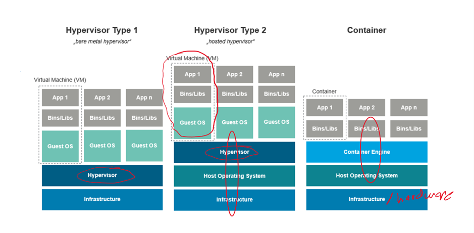
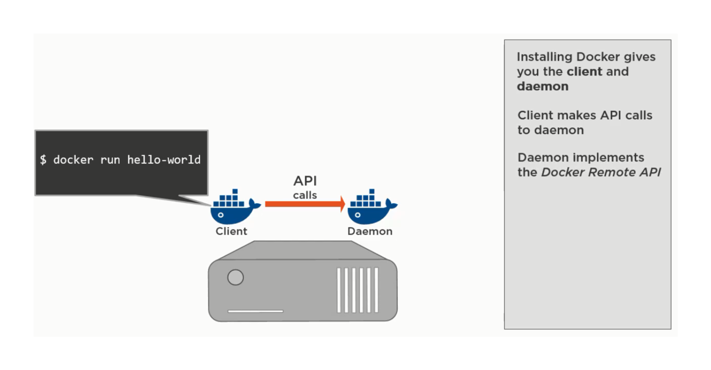

# Docker
Docker is a set of platform as a service products that use OS-level virtualization to deliver software in packages called containers. Containers are isolated from one another and bundle their own software, libraries and configuration files; they can communicate with each other through well-defined channels. 

* Container isn't a complete OS it is just a part of it
* Both Hypervisor use the entire OS
* More lightweight than a Hypervisor (Like another app running on the machine)
* Isolated from other processors

## comamnds

* docker rm [name] 
    - to remove a docker VM
* docker -ps 
    - shows all the running containers
* docker run -it ubuntu bash
    * Will run a new container with ubuntu OS with bash available 