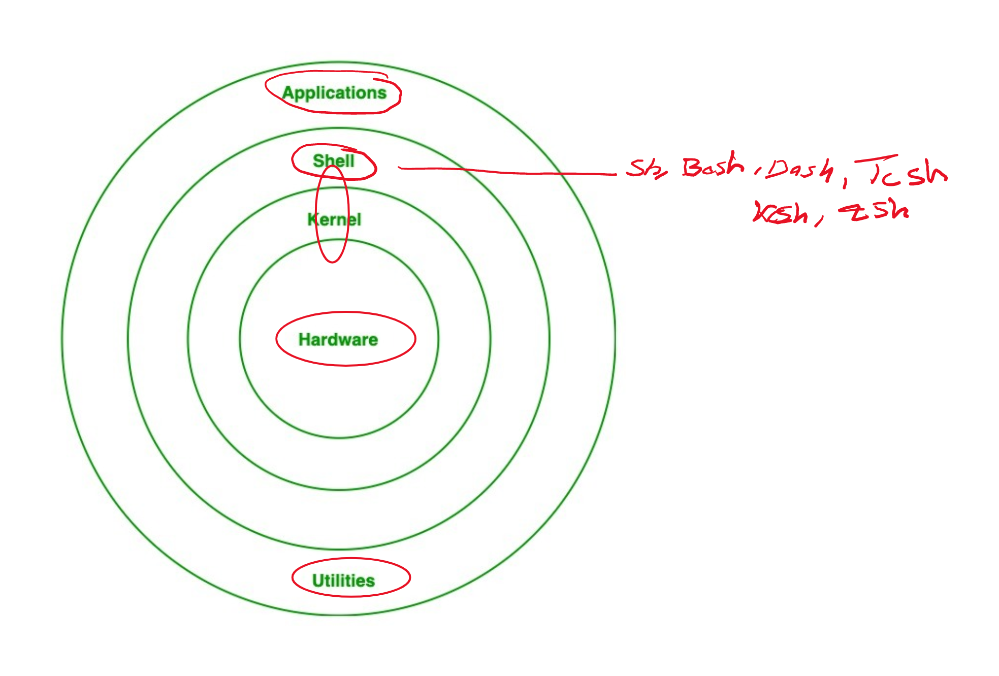
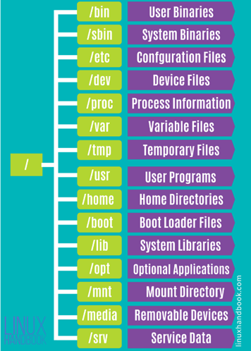

# Linux Essentials
## What is Linux
- Linux is completely open source
- Need to go through the kernel to communicate with the 
- Kernel is the in-between the shell and the hardware and is charge of the hardware
- Both CLI(Command line interface) & GUI can communicate with the shell in Linux

  
## Linux Distribution
Linux Distributions are slightly different Linux based OS that are created to specialist in different tasks.
### Debian

    - Ubuntu
    - Kali Linux : Cybersecurity 
### Fedoron

    - Red Hat : Commercial
    - Cento : Servers
### Arch Linux

## File System (protocol)
A system that controls how to store and restore the data on a OS 
### Ext4

    - Made to store large amounts of data
    - Standard used in Linux
### Ext3 
### BTRFS
### XFS

# Linux log file locations
### System Logs
Logs that deal with the system

    - Authorization log Location:  	/var/log/auth.log
    - Daemon Log var	/log/daemon.log
    - Debug Log Location: 	/var/log/debug
    - Kernel Log Location: 	/var/log/kern.log
    - System Log Location: 	/var/log/syslog
### Application Log
Logs that are created by the application 

    - Apache Logs: Location:	 /var/log/apache2/ (subdirectory)
    - X11 server log: Location: 	/var/log/Xorg.0.log

## Commands to remember
- Grep “example” file.txt
    - Will search through file.txt for word example
- More/ Less
    - Prints the content of a file page by page
- Head/Tail
    - Prints the top/button section of the file respectively 
- cat /etc/passwd
    - Prints all the users of the system
    - Grep user /etc/passwd (Only show given user)
- Nano/ Vim   
    - Used to edit a file          
- Chmod
    - Allows you to change the mode of the file (who can execute)
- Chown
    - Allows you to change the ownership of the file 
