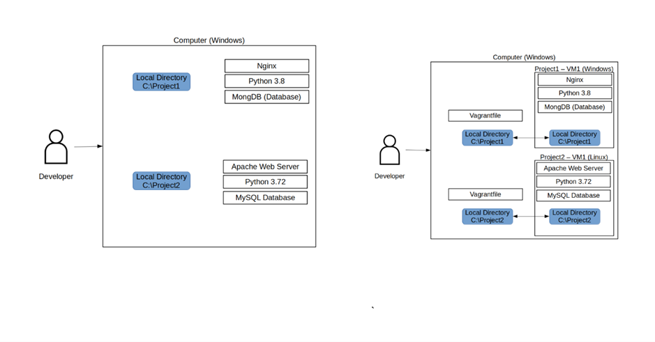

# Vagrant
* Software that you use to manage vms
* You can run a file that creates a vm on the staffs pc
* It is a building and management software 
* It is not a VM or a Hypervisor    

  
## Commands
* “Vagrant Init hashicorp/bionic64”(Name of OS) – The initialization of the VM 
* “Vagrant up” - Will start up the machine and download the OS that you selected if It can not be found locally 
* “Vagrant ssh” – this will put you into the VM that vagrant created this stage it will also appear on VM box                                                                                   
                      